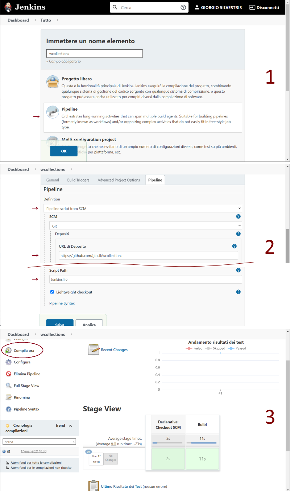

# Wrapped Collections


A convenience library for collections management.

## Examples

```java
// Wrapped Map
WMap wmap = new WMap(mapOfValues);

int    iValue  = wmap.getInt(key,    0);
double dValue  = wmap.getDouble(key, 3.14d);
String sValue  = wmap.getString(key, "");
Date   dtValue = wmap.getDate(key,   null);

// Wrapped List 
WList wlist = new WList(list);

int  intVal = wlist.getInt(0);

// Wrapped Structure 
WStruct wstruct = new WStruct(mapOfValues);

String name = wstruct.getString("person.name");

// Utils and Beans manipulation
Person person = WUtil.populateBean(Person.class, mapOfValues);

Map<String, Object> mapPerson = WUtil.toMapObject(person, false);
```

## Build

- `git clone https://github.com/giosil/wcollections.git`
- `mvn clean install`

## Revert and clean 

- `git reset --hard` to discarde any changes not committed to tracked files in the working tree
- `git clean -fxd` to delete untracked file recursively (f) and directories (d) also in .gitignore (x)

## Build on Jenkins



## Contributors

* [Giorgio Silvestris](https://github.com/giosil)
